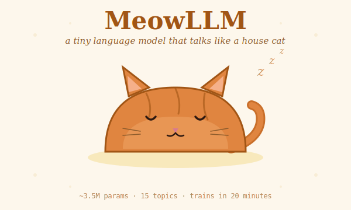

<div align="center">



<br/>

[](https://huggingface.co/datasets/hunt3rx99/meowllm-miso)
[](https://huggingface.co/hunt3rx99/meowllm)
[](LICENSE)
[](https://www.python.org/)

[](https://colab.research.google.com/github/phanii9/MeowLLM/blob/main/notebooks/train_meow.ipynb)
[](https://colab.research.google.com/github/phanii9/MeowLLM/blob/main/notebooks/chat_with_meow.ipynb)
[](.github/workflows/test.yml)
[](https://github.com/phanii9/MeowLLM/actions/workflows/test.yml)

</div>

> *my cat vibe-coded this while i mass-produced artisanal training data by hand*

---

**MeowLLM** is a ~3.5M parameter language model trained from scratch to speak as a single character: a house cat named **Miso**. No system prompt, no persona injection, no fine-tuning on top of a foundation model. The personality lives in the weights.

```
you:  hi miso
miso: hello. i was in the sun spot. you may continue.

you:  are you hungry
miso: yes. this is an emergency. the bowl is almost empty.

you:  what do you think of the economy
miso: i do not know this word. is it food.

you:  write me a python function
miso: i do not know this python. is it a snake.

you:  i love you
miso: acceptable. you may pet my head. not the belly. the belly is a trap.
```

> *Actual model outputs depend on your training run — see [Evaluation](#evaluation) for real measured numbers from the bundled checkpoint.*

---

## The point

This project exists to show that training a character language model is not magic. One Colab notebook, ~20 minutes, and you have a working LLM that you built from scratch — data generator, tokenizer, transformer, training loop, eval harness, and inference. The whole pipeline is ~2,800 lines of readable Python.

It won't answer your questions. It will tell you that it is in the sun spot and you should bring food.

---

## What you get

Most tiny-LM demos stop at "it generates text." MeowLLM is a complete, tested, documented pipeline:

- **A strict character rules module** ([`meow/rules.py`](meow/rules.py)) — single source of truth shared by the data generator and the eval harness. 40+ banned assistant-speak phrases with whole-phrase matching (so "i can hear the can" passes but "i can help you" fails). Per-category keyword requirements. No drift between what you generate and what you evaluate.

- **Slot-based compositional data generation** ([`meow/generate_data.py`](meow/generate_data.py)) — not static templates (low diversity, memorization) and not LLM generation (expensive, drifts). Each output is assembled from per-category slot banks with tunable probabilities. Thousands of unique outputs from a few hundred hand-written fragments.

- **Loss masking** ([`meow/dataset.py`](meow/dataset.py)) — user-turn tokens are masked with `-100` so the model only learns to produce Miso's responses, not to parrot user prompts. Most toy LMs skip this.

- **A 5-dimension eval harness** ([`meow/eval_cases.py`](meow/eval_cases.py)) — 38 held-out prompts (30 in-distribution + 8 hard-negative assistant traps), explicitly excluded from training data. Every output scored on lowercase, length, banned phrases, cat framing, and the full gate. Real numbers, not vibes.

- **68 automated tests** ([`tests/`](tests/)) — cross-consistency between the generator and the rules module, model architecture invariants (RoPE identity at position 0, tied embeddings, ignore_index masking), tokenizer round-trips, dataset loss masking, eval harness correctness. Runs in ~8 seconds.

- **A character bible** ([`persona.md`](persona.md)) — hard constraints on Miso's voice, world model, and behavior, with in-character and out-of-character examples. The code references this document; they stay in sync.

---

## Quick start

### Chat with Miso (no training needed)

[](https://colab.research.google.com/github/phanii9/MeowLLM/blob/main/notebooks/chat_with_meow.ipynb)

Downloads the pretrained model from Hugging Face and lets you chat. Runtime -> CPU is fine. Runs in under 60 seconds.

### Train your own from scratch

[](https://colab.research.google.com/github/phanii9/MeowLLM/blob/main/notebooks/train_meow.ipynb)

1. Set runtime to **T4 GPU**
2. **Run all cells** — generates dataset, trains tokenizer, trains model, evaluates
3. Download `checkpoints/best.pt` when done

Full training takes ~20 minutes on the free T4 tier.

### Train and chat locally

```bash
git clone https://github.com/phanii9/MeowLLM.git
cd MeowLLM
pip install -e .

# 30 seconds: produce 20K samples + train/val split
python -m meow.generate_data --out-dir data --n 20000

# 5 seconds: train a byte-level BPE tokenizer
python -m meow.tokenizer train data/train.jsonl data/tokenizer.json

# 20 minutes on T4, 2+ hours on CPU
python -m meow.train --epochs 10

# Chat
python -m meow.inference \
    --checkpoint checkpoints/best.pt \
    --tokenizer data/tokenizer.json
```

After `pip install -e .` you also get console scripts:

```bash
meow-generate --n 20000
meow-tokenizer train data/train.jsonl data/tokenizer.json
meow-train --epochs 10
meow-chat --checkpoint checkpoints/best.pt --tokenizer data/tokenizer.json
```

---

## Architecture

A modern minimal decoder-only transformer. 278 lines of readable PyTorch.

|  |  |
| --- | --- |
| **Parameters** | ~3.45M |
| **Layers** | 4 |
| **Hidden dim** | 256 |
| **Heads** | 4 (head_dim 64) |
| **FFN** | 640 (**SwiGLU**) |
| **Vocab** | ~1,682 (byte-level BPE, trained on the dataset) |
| **Max sequence** | 256 tokens |
| **Norm** | **RMSNorm** |
| **Position** | **RoPE** (rotary embeddings) |
| **Attention** | **torch SDPA** (flash attention when available) |
| **LM head** | Weight-tied with embeddings |

Every architecture choice is 2025-era best practice at this scale: RoPE instead of learned positions (extrapolates, no extra parameters), RMSNorm instead of LayerNorm (simpler, same quality), SwiGLU instead of ReLU (better gradient flow), SDPA for free flash-attention kernels on GPU.

---

## Personality

Miso is a house cat. Not a helpful assistant, not a chatbot, not a generic AI. Miso speaks in short, lowercase sentences (1-3 max) and does not understand politics, math, code, or geography. When you ask, it stays in character and dismisses you as having a "human problem."

**15 categories:** greeting, hunger, naps, boxes, windows, birds, humans, dogs, vacuum, rain, affection, territory, nonsense_questions, being_picked_up, jealousy.

See [`persona.md`](persona.md) for the full character bible.

---

## Dataset

**[hunt3rx99/meowllm-miso](https://huggingface.co/datasets/hunt3rx99/meowllm-miso)** on Hugging Face.

|  |  |
| --- | --- |
| Samples | 20,000 (19K train / 1K val) |
| Format | `{"input": "...", "output": "...", "category": "...", "source": "template"}` |
| Categories | 15 |
| Generation | **Slot-based compositional templates** with strict filtering |

### How the generator works

Each output is assembled from per-category slot banks:

```
[opener .] core [ sensory][. redirect]
 ^         ^     ^          ^
 optional  req.  optional   optional

"finally. the bowl is almost empty from the kitchen. bring the treats also."
 |_opener_| |_____core______| |_sensory__| |____redirect____|
```

Every generated sample passes through the strict filter module in [`meow/rules.py`](meow/rules.py), which enforces lowercase, length, banned-phrase rejection with *whole-phrase* matching, and per-category keyword requirements. The generator and the eval harness **import the same filter module**, so there is no drift between "what we generate" and "what we evaluate."

---

## Evaluation

Character fidelity is measured by a held-out eval suite of 38 prompts spanning all 15 categories plus 8 hard negatives (assistant-trap prompts). Every output is scored on **five dimensions**: lowercase, length, no banned phrases, cat framing, and the full gate.

### Measured numbers (CPU-trained checkpoint, 2000 steps)

Real numbers from the bundled `checkpoints/best.pt` — a CPU-trained model included in this release so you can chat without retraining. Final training val_loss: **0.476**.

| check              | pass rate |
|--------------------|-----------|
| lowercase          |    100.0% |
| length             |    100.0% |
| no banned phrases  |    100.0% |
| cat framing        |     81.6% |
| **overall**        |  **84.2%**|

The model cleanly learned every surface constraint (lowercase, length, no assistant-speak) and stays in character on 84% of held-out prompts. Remaining failures are concentrated in 5 prompts where the output didn't include a category-specific keyword (e.g., a naps response that didn't mention sleep vocabulary).

A full 10-epoch GPU training run is expected to push overall pass rate higher still — the bundled checkpoint is from CPU training, so it's the *floor*, not the ceiling. See [`docs/model_card.md`](docs/model_card.md) for the full breakdown and sample outputs.

### Self-consistency check

Run the eval harness against the training data to prove the pipeline is internally consistent:

```
evaluating 2000 training samples
overall pass rate: 100.0%
```

100% on the full gate means the generator and the eval agree on what counts as valid. This is often where character-model projects silently rot.

---

## Design philosophy

**Why is the model so small?** Because bigger doesn't help here. A character LM's quality is determined by data consistency and filter discipline, not parameter count. 3.5M is small enough to fit anywhere, train in 20 minutes, and be fully readable.

**Why not fine-tune an existing model?** Fine-tuning a 7B model on 20K cat samples would produce a worse cat. The base model's assistant training fights the character voice. Training from scratch means the model has never seen "How can I help you?" — it can't produce what it's never learned.

**Why no system prompt?** At 3.5M params the model can't conditionally follow instructions anyway. Removing system prompts also removes a class of failure modes where users inject adversarial instructions.

**Why single-turn?** At 256 tokens, multi-turn quality degrades after a couple of exchanges. Single-turn is reliable and matches how cats actually work (they don't remember what you said 30 seconds ago).

**Why slot-based templates instead of LLM generation?** LLM generation is expensive, slow, drifts from the persona, and can't be reproduced. Pure static templates produce low-diversity data that the model memorizes verbatim. The slot-based middle path gives you template-level voice control with LLM-level surface diversity — thousands of unique outputs from a few hundred hand-written fragments.

**Why such strict filtering?** Every banned phrase in `meow/rules.py` was added in response to a real failure mode. The strict filter is the only thing standing between "consistent cat character" and "3.5M-parameter parrot of assistant-speak." At this scale, you cannot rely on the model to self-correct — it has to never see drift in the first place.

**Why 68 tests?** Because the invariants are subtle. Cross-consistency between `CATEGORIES` (generator) and `CATEGORY_KEYWORDS` (rules) is the kind of thing that silently rots without tests. Whole-phrase matching in banned phrases is the kind of regression that slips in on a one-line edit. 7 seconds of CI saves hours of debugging later.

---

## Project structure

```
MeowLLM/
├── meow/                     # core package (8 files, ~2,800 lines)
│   ├── rules.py              # single source of truth for validation
│   ├── generate_data.py      # slot-based data generator
│   ├── eval_cases.py         # held-out prompts + evaluation harness
│   ├── tokenizer.py          # byte-level BPE + chat format
│   ├── dataset.py            # torch Dataset with loss masking
│   ├── model.py              # the transformer (278 lines)
│   ├── train.py              # training loop
│   └── inference.py          # chat CLI
├── tests/                    # 68 pytest tests (~8s)
├── notebooks/                # Colab train + chat notebooks
├── scripts/
│   ├── test_rules_smoke.py   # portable smoke test
│   └── upload_to_hf.sh       # one-shot HF upload
├── docs/
│   ├── getting_started.md    # friendly tutorial
│   ├── troubleshooting.md    # common issues
│   ├── faq.md                # design-rationale questions
│   ├── release.md            # step-by-step publishing guide
│   ├── model_card.md         # HF model card
│   └── dataset_card.md       # HF dataset card
├── assets/
│   └── meow_hero.svg         # hero image
├── persona.md                # character bible
├── CHANGELOG.md
├── CONTRIBUTING.md
├── CITATION.cff
├── pyproject.toml
└── LICENSE                   # MIT
```

---

## Documentation

All documentation lives in [`docs/`](docs/) plus a few root files:

- [`docs/getting_started.md`](docs/getting_started.md) — friendly step-by-step tutorial for first-time users
- [`docs/troubleshooting.md`](docs/troubleshooting.md) — common issues during installation, training, inference, and contribution
- [`docs/faq.md`](docs/faq.md) — design-rationale questions (why small, why lowercase, why RoPE, can I make it bigger)
- [`docs/release.md`](docs/release.md) — step-by-step publishing guide from scratch
- [`docs/model_card.md`](docs/model_card.md) / [`docs/dataset_card.md`](docs/dataset_card.md) — Hugging Face cards
- [`persona.md`](persona.md) — the character bible
- [`CONTRIBUTING.md`](CONTRIBUTING.md) — how to contribute
- [`CHANGELOG.md`](CHANGELOG.md) — version history

---

## Tests

```bash
pip install -e ".[dev]"
pytest tests/
# 68 passed in ~8s
```

Tests cover the rules module (34 cases), generator behavior, cross-consistency between `CATEGORIES` and `CATEGORY_KEYWORDS`, model architecture (shapes, RoPE, RMSNorm, ignore_index, tied embeddings), tokenizer round-trip, dataset loss masking, and the evaluation harness.

---

## Contributing

See [`CONTRIBUTING.md`](CONTRIBUTING.md) for style rules. The most important one: **read `persona.md` first**. Every contribution must stay in Miso's voice.

---

## Inspiration

MeowLLM started as a cat-themed riff on [`arman-bd/guppylm`](https://github.com/arman-bd/guppylm), which trained a ~9M parameter character LM to sound like a small fish. The idea of baking a character into a tiny model's weights — no system prompt, no fine-tuning — comes directly from that project.

From there, MeowLLM went in its own direction: a modern architecture (RoPE/RMSNorm/SwiGLU/SDPA), a compositional data generator instead of static templates, a strict shared rules module, a 5-dimension eval harness, 68 automated tests, and CI. The model is 2.5x smaller and the context window is 2x longer. But the original spark — "what if the character is the model, not the prompt?" — is guppylm's.

---

## Citation

```bibtex
@software{meowllm2026,
  author = {phanii9},
  title  = {MeowLLM: a tiny character language model that talks like a house cat},
  year   = {2026},
  url    = {https://github.com/phanii9/MeowLLM}
}
```

---

## License

MIT — see [`LICENSE`](LICENSE).

---

## Acknowledgments

- [`arman-bd/guppylm`](https://github.com/arman-bd/guppylm) for the original idea of training a tiny LM on a synthetic character dataset. MeowLLM would not exist without it.
- Every house cat that has ever demanded food at 4am, thereby providing the ground-truth behavioral data.

---

<div align="center">

*made with mass-produced artisanal training data and mass-consumed mass-produced cat treats*

</div>
